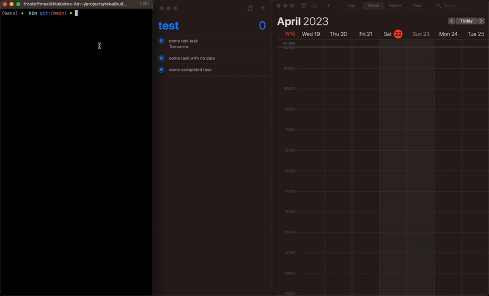

#  ReKa 

### Sync your reminders with calendar

```shell
USAGE: reka <reminders-list> <calendar-name>

ARGUMENTS:
  <reminders-list>        Reminders list name to sync with calendar
  <calendar-name>         Calendar name that will be use to sync

OPTIONS:
  -h, --help              Show help information.
```

### Installation

1. Put `reka` binary to `/usr/local/bin` folder

2. Run sync at background

I suggest using launchd to periodically sync your events. 

To do this, you need to put a `com.example.frostoffmax.reka.plist` file in your `~/Library/LaunchAgents` directory.

Here's an example of a launchd agent that will start every 10 seconds with reminders list name `test` and calendar name `Home`:

```xml
<?xml version="1.0" encoding="UTF-8"?>
<!DOCTYPE plist PUBLIC "-//Apple//DTD PLIST 1.0//EN" "http//www.apple.com/DTDs/PropertyList-1.0.dtd">
<plist version="1.0">
<dict>
    <key>Label</key>
    <string>com.example.frostoffmax.reka</string>
    <key>ProgramArguments</key>
    <array>
        <string>/usr/local/bin/reka</string>
        <string>test</string>
        <string>Home</string>
    </array>
    <key>StartInterval</key>
    <integer>10</integer>
</dict>
</plist>
```


